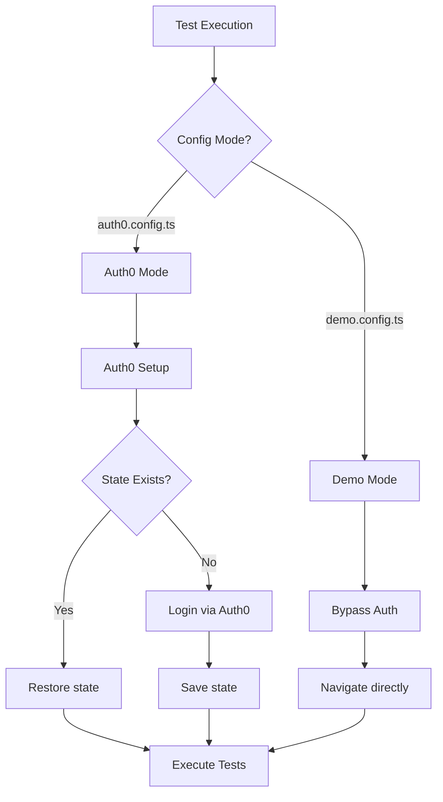

# End-to-End Testing Guide

## Table of Contents

- [Quick Start](#quick-start)
- [Architecture](#architecture)
- [Authentication Modes](#authentication-modes)
- [Running Tests](#running-tests)
- [Test Organization](#test-organization)
- [Writing Tests](#writing-tests)
- [Configuration](#configuration)
- [Tag System](#tag-system)
- [Best Practices](#best-practices)
- [Troubleshooting](#troubleshooting)

## Quick Start

### 1. Installation

```bash
# Install dependencies
yarn install

# Install Playwright browsers
npx playwright install
```

### 2. Run Tests

```bash
# Run all E2E tests (default: demo mode)
yarn test:e2e

# Run with Playwright UI
yarn test:e2e:ui

# Run smoke tests only
yarn test:smoke
```

### 3. View Results

- Open `playwright-report/index.html` in your browser
- Check console output for immediate results
- Review screenshots/videos in `test-results/` on failure

## Architecture

### Directory Structure

```
e2e/
├── config/
│   ├── base.config.ts         # Shared Playwright configuration
│   ├── demo.config.ts         # Demo mode (bypass auth)
│   └── auth0.config.ts        # Auth0 mode (real auth)
├── fixtures/
│   ├── auth.fixture.ts        # Authentication fixtures
│   └── auth0.setup.ts         # Auth0 authentication setup
├── utils/
│   ├── selectors.ts           # Shared element selectors
│   └── test-data.ts           # Test data generators
├── tests/
│   ├── auth/                  # Authentication domain tests
│   │   ├── login-flow.spec.ts
│   │   └── signup-flow.spec.ts
│   ├── dashboard/             # Dashboard domain tests
│   │   ├── dashboard.spec.ts
│   │   └── dashboard-loading.spec.ts
│   ├── navigation/            # Navigation tests
│   │   ├── menu.spec.ts
│   │   └── home-page.spec.ts
│   └── smoke/                 # Smoke tests
│       └── smoke.spec.ts
└── playwright.config.ts       # Main config (root level)
```

### Design Principles

1. **Domain-Based Organization**: Tests are organized by domain (dashboard, auth, navigation)
2. **Testing Trophy**: Focus on integration tests with E2E for critical paths
3. **Dual Auth Modes**: Support for both demo (bypass) and Auth0 (real) authentication
4. **Shared Utilities**: Centralized selectors and test data for consistency

## Authentication Modes

The E2E suite supports two authentication modes:

### Demo Mode (Default)

Bypasses Auth0 authentication for faster, simpler testing.

```bash
yarn test:e2e:demo
```

**When to use:**
- Local development
- Quick validation
- CI smoke tests
- No Auth0 credentials needed

### Auth0 Mode

Uses real Auth0 authentication for production-like testing.

```bash
# Set credentials first
export E2E_TEST_EMAIL="your-test-user@example.com"
export E2E_TEST_PASSWORD="your-test-password"

# Run tests
yarn test:e2e:auth0
```

**When to use:**
- Full integration testing
- Pre-production validation
- Auth flow verification

### Auth Mode Flow



## Running Tests

### Available Commands

| Command | Description |
|---------|-------------|
| `yarn test:e2e` | Run all E2E tests |
| `yarn test:e2e:demo` | Run tests in demo mode |
| `yarn test:e2e:auth0` | Run tests with Auth0 authentication |
| `yarn test:e2e:ui` | Run tests with Playwright UI |
| `yarn test:smoke` | Run smoke tests only (`@smoke` tag) |

### Environment Variables

| Variable | Description | Default |
|----------|-------------|---------|
| `PLAYWRIGHT_BASE_URL` | Target environment URL | `http://localhost:5173` |
| `E2E_TEST_EMAIL` | Test user email (Auth0 mode) | - |
| `E2E_TEST_PASSWORD` | Test user password (Auth0 mode) | - |
| `CI` | CI environment flag | - |

### Running Specific Tests

```bash
# Run a specific test file
yarn test:e2e e2e/tests/dashboard/dashboard.spec.ts

# Run tests matching a pattern
yarn test:e2e --grep "should render"

# Run tests with specific tag
yarn test:e2e --grep @critical
```

## Test Organization

### Domain Structure

Tests are organized by domain to mirror the application architecture:

- **auth/**: Login, signup, and authentication flows
- **dashboard/**: Main dashboard functionality
- **navigation/**: Menu and routing tests
- **smoke/**: Quick validation tests

### Adding a New Domain

1. Create folder: `e2e/tests/{domain-name}/`
2. Add test files: `{feature}.spec.ts`
3. Use shared selectors from `e2e/utils/selectors.ts`
4. Apply appropriate tags (`@smoke`, `@critical`)

## Writing Tests

### Basic Test Structure

```typescript
import { test, expect } from '@playwright/test';
import { dashboard } from '../../utils/selectors';

test.describe('Feature Name @critical', () => {
  test.beforeEach(async ({ page }) => {
    await page.goto('/dashboard');
  });

  test('should do something @smoke', async ({ page }) => {
    await expect(dashboard.screenHeading(page)).toBeVisible();
  });
});
```

### Using Selectors

```typescript
import { dashboard, navigation } from '../../utils/selectors';

// Dashboard selectors
await expect(dashboard.screenHeading(page)).toBeVisible();
await expect(dashboard.matchdaySection(page)).toContainText('matchday');

// Navigation selectors
await navigation.menuLink(page, '/tournaments').click();
```

### Using Test Data

```typescript
import { testData, generateTestEmail } from '../../utils/test-data';

// Use predefined URLs
await page.goto(testData.urls.dashboard);

// Use timeouts
await page.waitForURL(/.*dashboard/, { timeout: testData.timeouts.auth });

// Generate unique data
const email = generateTestEmail('signup');
```

### Using Auth Fixtures

```typescript
import { test, expect } from '../../fixtures/auth.fixture';

test('authenticated test', async ({ authenticatedPage, authUser }) => {
  // Page is already authenticated
  await expect(authenticatedPage).toHaveURL(/.*dashboard/);
  console.log(`Logged in as: ${authUser.username}`);
});
```

## Configuration

### Base Configuration

All configurations extend from `e2e/config/base.config.ts`:

```typescript
export const baseConfig: PlaywrightTestConfig = {
  testDir: '../tests',
  fullyParallel: true,
  retries: process.env.CI ? 2 : 0,
  workers: process.env.CI ? 1 : undefined,
  reporter: [['html'], ['list']],
  use: {
    baseURL: process.env.PLAYWRIGHT_BASE_URL || 'http://localhost:5173',
    trace: 'on-first-retry',
    screenshot: 'only-on-failure',
    video: 'retain-on-failure',
  },
};
```

### Demo Configuration

`e2e/config/demo.config.ts` - For bypass authentication:

```typescript
export default defineConfig({
  ...baseConfig,
  metadata: { authMode: 'demo' },
});
```

### Auth0 Configuration

`e2e/config/auth0.config.ts` - For real authentication:

```typescript
export default defineConfig({
  ...baseConfig,
  projects: [
    { name: 'auth0-setup', testMatch: /auth0\.setup\.ts/ },
    { 
      name: 'chromium-auth0',
      storageState: '.auth/auth0-state.json',
      dependencies: ['auth0-setup'],
    },
  ],
});
```

## Tag System

### Available Tags

| Tag | Purpose | When to Use |
|-----|---------|-------------|
| `@smoke` | Quick validation | Core functionality checks |
| `@critical` | Must-pass tests | Business-critical features |
| `@slow` | Long-running tests | Performance or complex flows |

### Using Tags

```typescript
// On describe blocks (all tests inherit)
test.describe('Dashboard @critical', () => {
  test('loads correctly @smoke', async ({ page }) => {
    // Has both @critical and @smoke
  });
});

// On individual tests
test('complex flow @slow', async ({ page }) => {
  // Only has @slow
});
```

### Filtering by Tag

```bash
# Run smoke tests
yarn test:e2e --grep @smoke

# Run critical tests
yarn test:e2e --grep @critical

# Exclude slow tests
yarn test:e2e --grep-invert @slow
```

## Best Practices

### Selectors

1. **Use data-ui attributes**: `[data-ui="screen-heading"]`
2. **Centralize in selectors.ts**: Avoid duplicating selectors
3. **Use role-based selectors**: `getByRole('button', { name: 'Login' })`

### Test Independence

1. Each test should work in isolation
2. Don't depend on test execution order
3. Clean up test data when needed

### Assertions

1. Use explicit waits: `await expect(element).toBeVisible()`
2. Avoid arbitrary timeouts: Use `waitForLoadState` or `waitForURL`
3. Be specific: Check exact content when possible

### Performance

1. Use `networkidle` judiciously (it can be slow)
2. Run parallel tests when possible
3. Share authentication state between tests

## Troubleshooting

### Common Issues

**Tests fail with timeout**
```bash
# Increase timeout for specific test
test('slow test', async ({ page }) => {
  test.setTimeout(60000);
  // ...
});
```

**Auth0 tests fail**
```bash
# Ensure credentials are set
echo $E2E_TEST_EMAIL
echo $E2E_TEST_PASSWORD

# Clear auth state and retry
rm -rf .auth/
yarn test:e2e:auth0
```

**Flaky tests**
1. Add explicit waits for dynamic content
2. Use `toBeVisible()` before interacting
3. Consider network conditions

**Element not found**
1. Check if element exists with DevTools
2. Verify selector in Playwright UI mode
3. Ensure page has finished loading

### Debug Mode

```bash
# Run with headed browser
yarn test:e2e --headed

# Run with Playwright Inspector
PWDEBUG=1 yarn test:e2e

# Run specific test with UI
yarn test:e2e:ui e2e/tests/dashboard/dashboard.spec.ts
```

### CI/CD

E2E tests run on a scheduled basis (daily at 2:00 AM UTC) against staging environment. They are decoupled from the deployment pipeline to avoid blocking deployments.

See `.github/workflows/playwright.yml` for CI configuration.
