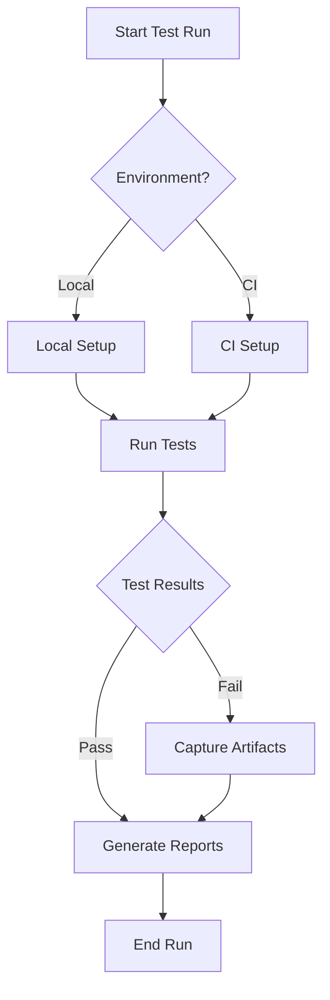
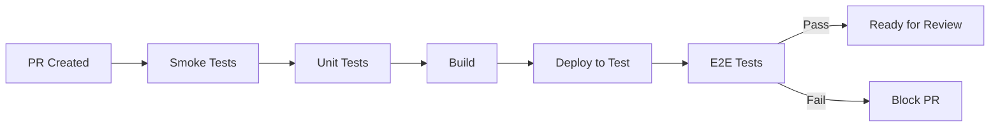
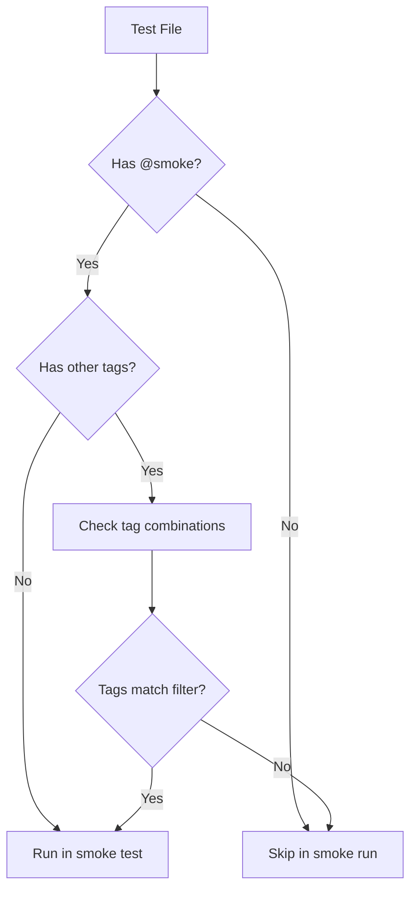
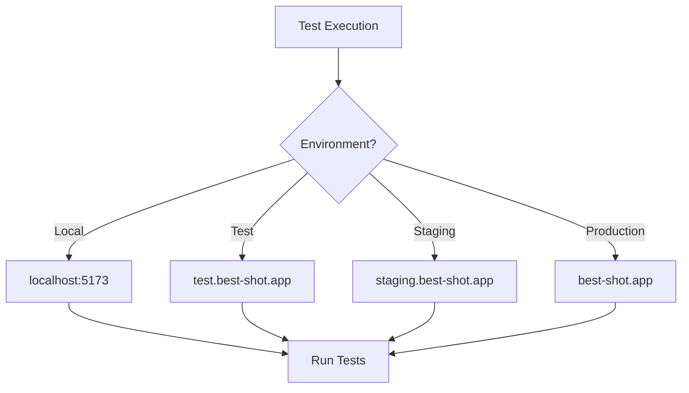

# End-to-End Testing Guide

## Table of Contents

- [Quick Start](#quick-start)
- [Concepts](#concepts)
- [Overview](#overview)
- [Test Types](#test-types)
- [Smoke Testing](#smoke-testing)
- [Running Tests](#running-tests)
- [Test Organization](#test-organization)
- [Configuration](#configuration)
- [Best Practices](#best-practices)
- [Reporting](#reporting)
- [Troubleshooting](#troubleshooting)
- [Test Flow Diagrams](#test-flow-diagrams)

## Quick Start

### 1. Installation

```bash
# Install dependencies
yarn install

# Install Playwright browsers
npx playwright install
```

### 2. Write Your First Test

Create a file `e2e/tests/my-first-test.spec.ts`:

```typescript
import { test, expect } from "@playwright/test";

test("my first test @smoke", async ({ page }) => {
 await page.goto("/");
 await expect(page).toHaveTitle(/Best Shot/);
});
```

### 3. Run Tests

```bash
# Run locally
yarn test:smoke:local

# Run with UI mode
yarn test:smoke:ui
```

### 4. View Results

- Open `playwright-report/index.html` in your browser
- Check the console output for immediate results
- Review any screenshots/videos in `test-results/`

## Concepts

### Understanding Test Tags

1. **Tag Definition**

   ```typescript
   // Tags are special annotations in test titles
   test('feature works @smoke', ...);
   test.describe('Auth Tests @smoke @critical', ...);
   ```

2. **Tag Inheritance**

   ```typescript
   test.describe('Feature @smoke', () => {
     test('test1', ...); // Inherits @smoke
     test('test2 @critical', ...); // Has both @smoke and @critical
   });
   ```

3. **Tag Composition**

   ```mermaid
   graph TD
     A[Test Suite] --> B[Feature Group @smoke]
     B --> C[Test 1]
     B --> D[Test 2 @critical]
     B --> E[Test 3 @perf]
   ```

### Tag Behavior

1. **Execution Flow**

   ```mermaid
   flowchart LR
     A[Test Runner] -->|grep @smoke| B[Find Tagged Tests]
     B --> C{Tag Match?}
     C -->|Yes| D[Execute Test]
     C -->|No| E[Skip Test]
   ```

2. **Environment Impact**

   ```typescript
   // Tags can affect test behavior
   test("feature @smoke", async ({ page }) => {
    if (process.env.SMOKE_ONLY) {
     // Run minimal version
    } else {
     // Run full version
    }
   });
   ```

3. **CI/CD Integration**

   ```mermaid
   flowchart TD
     A[PR Created] --> B[Run @smoke tests]
     B --> C{Tests Pass?}
     C -->|Yes| D[Continue Deployment]
     C -->|No| E[Block PR]
   ```

## Overview

This project uses Playwright for end-to-end testing. The testing strategy includes:

- Smoke tests for rapid verification
- Full E2E tests for comprehensive coverage
- Visual regression tests (coming soon)

## Test Types

### Smoke Tests (`@smoke`)

Quick tests that verify core functionality is working. These run:

- On every PR
- Before deployment
- After deployment
- During rollbacks

### Critical Tests (`@critical`)

Tests that must pass for the application to be considered functional:

- Authentication flows
- Core business logic
- Data persistence
- API integration

### Performance Tests (`@perf`)

Tests that measure and verify performance metrics:

- Page load times
- API response times
- Resource loading
- Animation performance

## Smoke Testing

### Concept

Smoke testing, also known as "build verification testing" or "sanity testing," verifies that the most critical functionalities work before proceeding with more extensive testing. The name comes from hardware testing: "Don't do more testing if the device is smoking."

### Key Principles

- Quick to run (< 5 minutes)
- Tests critical paths only
- Runs before deeper testing
- Must pass before deployment
- Identifies show-stopping issues early

### Test Coverage Areas

1. **Core Application Health**

   ```typescript
   test.describe('Core Application Health', () => {
     test('homepage loads successfully', ...);
     test('critical API endpoints respond', ...);
     test('routes are accessible', ...);
   });
   ```

2. **Authentication**

   ```typescript
   test.describe('Authentication', () => {
     test('login flow works', ...);
     test('auth state initializes', ...);
   });
   ```

3. **UI Components**

   ```typescript
   test.describe('UI Components', () => {
     test('navigation is functional', ...);
     test('critical elements present', ...);
   });
   ```

4. **Asset Loading**

   ```typescript
   test.describe('Asset Loading', () => {
     test('static assets load', ...);
     test('images load properly', ...);
   });
   ```

5. **Error Handling**

   ```typescript
   test.describe('Error Handling', () => {
     test('404 page works', ...);
     test('error boundaries work', ...);
   });
   ```

## Running Tests

### Available Commands

```bash
# Run all tests
yarn test:e2e

# Run smoke tests only
yarn test:smoke

# Run smoke tests with UI
yarn test:smoke:ui

# Run smoke tests against local environment
yarn test:smoke:local
```

### Environment Variables

- `PLAYWRIGHT_TEST_BASE_URL`: Target environment URL
- `SMOKE_ONLY`: Run only smoke tests when true
- `CI`: Adjusts test behavior for CI environment

## Test Organization

### Tag System

1. **Test Types**

   ```typescript
   @smoke     // Basic functionality
   @critical  // Must-pass features
   @e2e       // Full end-to-end flows
   @perf      // Performance tests
   ```

2. **Test Characteristics**

   ```typescript
   @slow      // Long-running tests
   @flaky     // Known unstable tests
   @visual    // Visual regression tests
   ```

3. **Feature Areas**

   ```typescript
   @auth      // Authentication tests
   @api       // API-related tests
   @ui        // UI-related tests
   ```

### Tag Usage

1. **On Describe Blocks**

   ```typescript
   test.describe("Feature Tests @smoke", () => {
    // All tests inherit @smoke tag
   });
   ```

2. **On Individual Tests**

   ```typescript
   test("feature works @smoke @critical", async () => {});
   ```

3. **Tag Filtering**

   ```bash
   # Run smoke tests only
   yarn playwright test --grep @smoke

   # Run critical smoke tests
   yarn playwright test --grep "@smoke.*@critical"
   ```

## Configuration

### Smoke Test Configuration

```typescript
// e2e/smoke.config.ts
const config: PlaywrightTestConfig = {
 grep: /@smoke/,
 testMatch: ["**/smoke.spec.ts"],
 retries: 2,
 timeout: 30000,
 reporter: ["html", "json", "list"],
 use: {
  trace: "retain-on-failure",
  screenshot: "only-on-failure",
  video: "retain-on-failure",
 },
};
```

### Global Setup/Teardown

```typescript
// e2e/global-setup.ts
async function globalSetup(config: FullConfig) {
 // Environment setup
 // Test data preparation
 // Authentication setup
}

// e2e/global-teardown.ts
async function globalTeardown(config: FullConfig) {
 // Cleanup
 // Reset state
 // Clear test data
}
```

## Best Practices

### Tag Usage

1. Use consistent naming conventions
2. Document tag meanings
3. Don't overuse tags
4. Use hierarchical organization
5. Consider tag combinations carefully

### Test Writing

1. Keep tests focused and atomic
2. Use descriptive test names
3. Group related tests logically
4. Handle test data cleanup
5. Avoid test interdependencies

### CI/CD Integration

1. Run smoke tests first
2. Use appropriate timeouts
3. Implement retry strategies
4. Preserve failure artifacts
5. Configure proper reporting

## Reporting

Test results are available in multiple formats:

- HTML reports (`playwright-report/`)
- JSON results (`smoke-test-results.json`)
- Console output (during execution)
- CI/CD pipeline logs

## Troubleshooting

Common issues and solutions:

1. **Flaky Tests**

   - Increase timeouts
   - Add retry logic
   - Check for race conditions

2. **CI Failures**

   - Check environment variables
   - Verify browser dependencies
   - Review resource constraints

3. **Performance Issues**
   - Reduce parallel execution
   - Optimize test setup
   - Clean up test data

## Test Flow Diagrams

### 1. Test Execution Flow



### 2. Smoke Test Pipeline



### 3. Tag Resolution



### 4. Test Environment Flow


